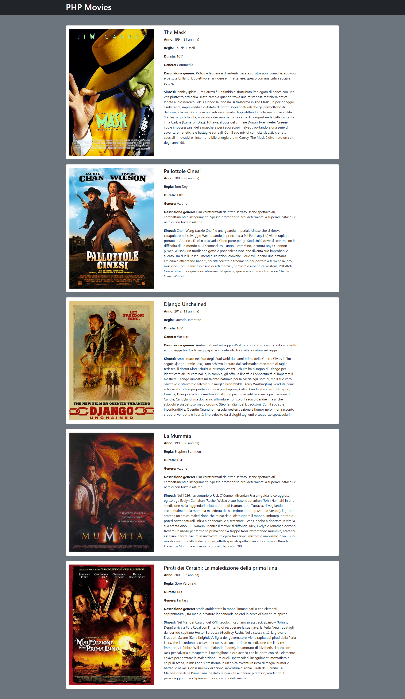

# Descrizione
- Nome repo: ex-php8-oop-movie

Alleniamoci con la OOP di PHP immaginando delle classi pertinenti a Film e generi cinematografici

## Svolgimento
Creare un file index.php in cui
- è definita la classe Movie

   => all'interno della classe sono dichiarate delle proprietà

   => all'interno della classe è definito un costruttore

   => all'interno della classe è definito almeno un metodo

- vengono istanziati almeno due oggetti ‘Movie’ e stampati a schermo i valori delle relative proprietà

## Bonus 1
Modificare la classe Movie in modo che accetti piú di un genere.

## Bonus 2
Creare un layout completo per stampare a schermo una lista di film.
Facciamo attenzione all’organizzazione del codice, suddividendolo in appositi file e cartelle.

Possiamo ad esempio organizzare il codice
- creando un file dedicato ai dati (tipo le array di oggetti) che potremmo chiamare db.php
- mettendo ciascuna classe nel proprio file e magari raggruppare tutte le classi in una cartella dedicata che possiamo chiamare Models/
- organizzando il layout dividendo la struttura ed i contenuti in file e parziali dedicati.

# Risultato

